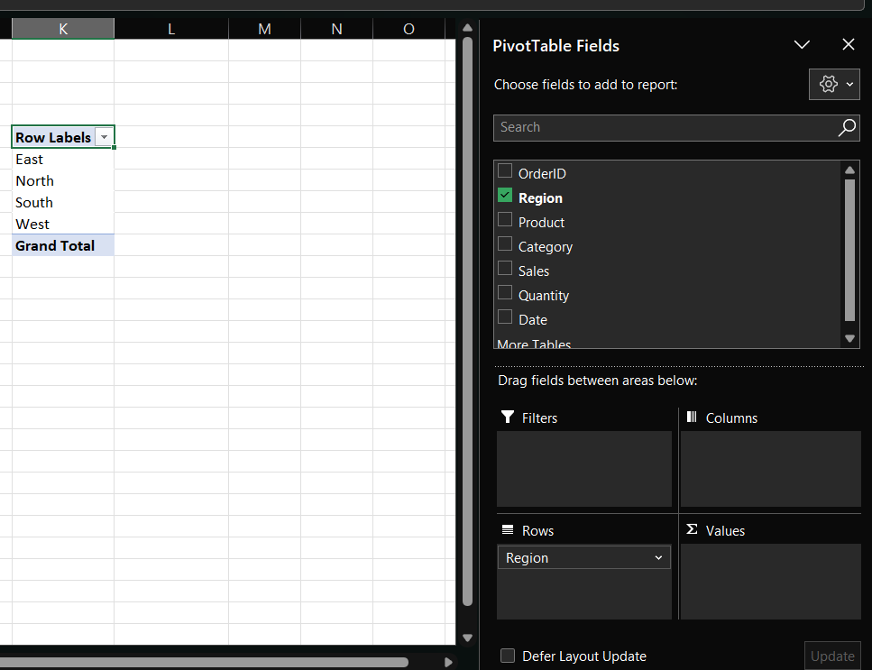
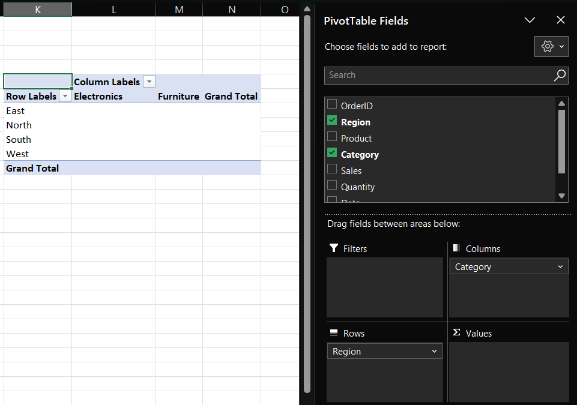
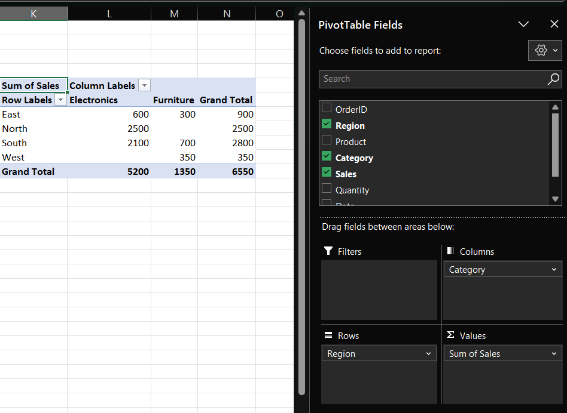
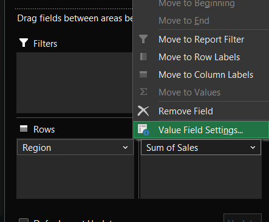
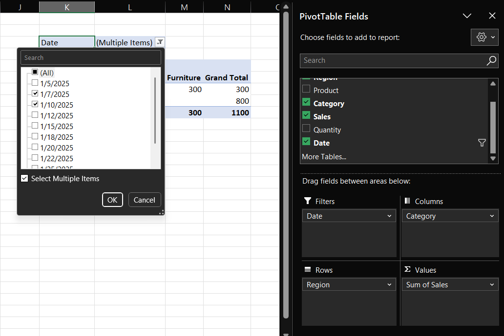
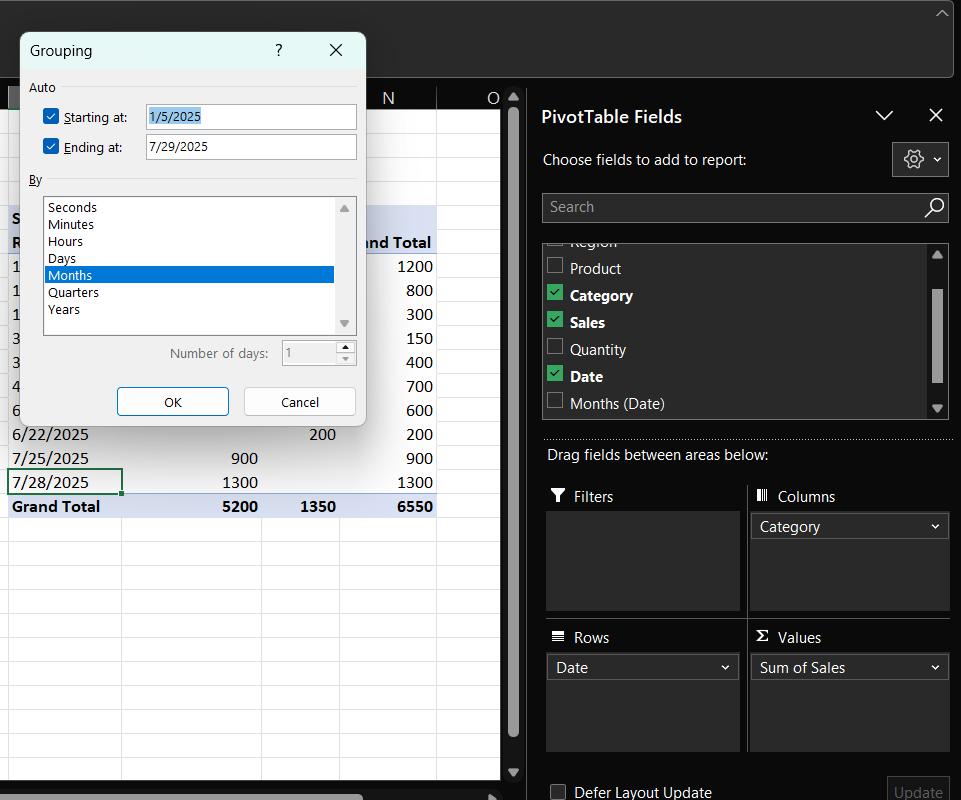

# How to use Pivot Table in Excel

`Pivot Table` in `Excel` allow you to quickly summarize, analyze, explore, and present large amounts of data. They are useful for creating reports and identifying trends without complex formulas.

---

## to prepare data
- Ensure data is organized in a tabular format.
- Each column should have a header.
- Avoid blank rows or merged cells.

!!! tip
    You can find data sample used in this guide here [sample_pivot.xlsx](assets/sample_pivot.xlsx)

---

## to create a pivot table
Select any cell within your dataset and go to `Insert > PivotTable`.

Choose whether to place the Pivot Table in a new worksheet or existing worksheet then click `OK`.

---

## to analyze Pivot Table fields

### for `Rows`

`Rows` define the primary grouping of your data. Each unique entry in the chosen field becomes a row label. This is useful for breaking down totals by categories such as product lines, geographic regions, or departments. 

Use categorical fields with a manageable number of distinct values (like `Region`, `Product`, or `Category`) for `Rows`. Avoid unique identifiers (like `OrderID`, `CustomerID`, or `Invoice Number`) because they prevent meaningful aggregation and obscure insights.

!!! note annotate "Example (1)"

    Placing `Region` (2) in Rows will list `North`, `South`, `East`, and `West` vertically (3).

    We can add `Column` and `Value` later to create a matrix for analyzing data.

1.  Based on dataset: [sample_pivot.xlsx](assets/sample_pivot.xlsx)
   
2.  `Region` is a strong choice as it has `limited` and `meaningful categories`: `North`, `South`, `East`, `West` are few in number and     represent logical divisions of the business.

    On the other hand, something like `OrderID` is not suitable as:

    - `Excessive granularity`: Each order has a unique ID, so placing `OrderID` in `Rows` would generate hundreds or thousands of row labels, cluttering the Pivot Table.
    - `No aggregation benefit`: Since each `OrderID` is unique, the `Pivot Table` would simply reproduce the raw dataset instead of summarizing it.
    - `Poor readability`: A Pivot Table with `OrderID` as rows loses the purpose of summarization. It becomes a long list rather than a structured analysis tool.

3.  

### for `Columns`

`Columns` define the secondary grouping of your data. Each unique entry in the chosen field becomes a column header. This is useful for creating cross‑tab comparisons, allowing you to see how different categories perform side by side.

Use categorical fields with a limited number of distinct values (like `Category`, `Product Type`, or `Year`) for `Columns`. Avoid fields with too many unique values (like `OrderID` or `Customer Name`) because they will generate excessive columns and reduce readability.

!!! note annotate "Example "

    Placing `Category` (1) in Columns will create headers such as `Electronics` and `Furniture` (2).

    Combined with `Region` in Rows and `Sales` in Values, this produces a matrix showing total sales by Region across each Category.

1.  `Category` is a strong choice because:
   
    - It has `limited and meaningful categories` (`Electronics`, `Furniture`).
    - It enables `comparative insight`: you can see which Region sells more Electronics versus Furniture.
    - It provides `clarity`: you can quickly interpret performance differences across product categories.

    Something like `OrderID` or `Customer Name` is not suitable as:

    - `Excessive granularity`: Each order or customer would create a separate column, leading to hundreds of columns.
    - `No aggregation benefit`: The Pivot Table would become a wide, unreadable dataset instead of a summary.
    - `Poor readability`: Too many columns obscure insights and make the table impractical for analysis.

2.  

### for `Values`

`Values` represent the numerical data that is aggregated in the Pivot Table. They are the core metrics of analysis, providing totals, averages, counts, or other calculations based on the fields you select.

Use numerical fields (like `Sales`, `Quantity`, or `Profit`) for `Values`. Avoid text fields (like `Region` or `Product Name`) because they cannot be meaningfully aggregated.

!!! note annotate "Example"

    Placing `Sales` (1) in Values will sum all sales figures for each Region and Category combination (2).

    Combined with `Region` in Rows and `Category` in Columns, this produces a matrix showing total sales by Region across each Category (3).

1.  `Sales` is a strong choice because:
    - It is `quantitative`: numerical values can be aggregated meaningfully.
    - It enables `summarization`: totals, averages, or counts can be calculated across categories.
    - It provides `insight`: you can quickly see which Region or Category generates the highest revenue.

    In contrast, something like `Product Name` is not suitable as:

    - `Non‑numeric`: text cannot be summed or averaged.
    - `No aggregation benefit`: each product name would simply be listed, duplicating the raw dataset.
    - `Poor readability`: the Pivot Table would lose its summarization power and become cluttered.
  
2.  
    
3.  Additional operations with Values:
   
    - `Summarize Values By`: change aggregation from `Sum` to `Count`, `Average`, `Max` or `Min`.
    - `Show Values As`: display results as percentages of totals, differences from other fields, or running totals.
    - `Number Formatting`: apply currency, percentage, or custom formats for clarity.

    Change operation type by `Left click` on the item under `Values` and select `Value Field Settings...`:

    

    Update operation under `Summarize value field by`:

    

### for `Filters`

`Filters` allow you to narrow down the dataset displayed in the Pivot Table. They act as a global constraint, meaning the entire table adjusts based on the filter selection. This is useful for focusing on specific time periods, product categories, or other conditions without changing the structure of Rows and Columns.

Use fields that represent dimensions you want to slice the data by (like `Date`, `Category`, or `Region`). Avoid using unique identifiers (like `OrderID`) because filtering by them reduces the dataset to a single record, which defeats the purpose of summarization.

!!! note annotate "Example"

    Placing `Date` (1) in Filters allows you to select a specific month or range to view only relevant sales (2).

    Combined with `Region` in Rows, `Category` in Columns, and `Sales` in Values, this produces a matrix that shows total sales by Region and Category for the chosen time frame.

1.  `Date` is a strong choice because:
    - It enables `time‑based analysis`: you can compare performance across months, quarters, or years.
    - It provides `flexibility`: the same Pivot Table can be reused to analyze different periods without rebuilding.
    - It enhances `focus`: stakeholders can drill down into specific time ranges to answer targeted questions.

    As explained above, `OrderID` is not suitable as a filter because:

    - `Excessive granularity`: filtering by a single order reduces the Pivot Table to one record.
    - `No summarization benefit`: the Pivot Table loses its aggregation power.
    - `Poor usability`: scrolling through thousands of OrderIDs to select one is impractical.

2.  

---

## to refine and manipulate data

### for `Group Data`
Grouping consolidates multiple items into higher‑level categories.  

- `Dates`: Group by days, months, quarters, or years.  
- `Numbers`: Group into ranges (e.g., sales between 0–500, 501–1000).  

!!! note annotate "Example"

    To group data by `Month` baed on `Date` as `Rows`:
 
    - Click on any cell that contains a date value within the Pivot Table and `Right click` on the cell and select `Group`. (1)
    - In the Grouping dialog box, choose `Month` and hit `OK`. (2)
    - Your data will be grouped by month in the pivot table (3)

1.  
2.  
3.  
4.  

Apply grouping when raw categories are too granular and when higher‑level patterns are more meaningful.

!!! note annotate "Example"

    - Group `Date` field into quarters to analyze seasonal trends.
    - Group `Quantity` into ranges to see order size distribution.
  

### for `Summarize Values`
This option controls how numerical fields are aggregated.  

- `Default`: Sum of values.  
- `Alternatives`: Count, Average, Max, Min, Product, Standard Deviation, Variance.   

!!! note annotate "Example"

    For `Sales`:
    
    - `Sum` shows total revenue.
    - `Count` shows number of transactions.
    - `Average` shows mean order value. 

  
Choose aggregation that aligns with the business question. 

- Performance analysis: `Sum` or `Average` is common. 
- Frequency analysis: `Count` is more useful.

### for `Sort and Filter`

Sorting and filtering allow you to organize and narrow down results.  

- `Sort`: Ascending or descending order by row or column labels, or by values.  
- `Filter`: Dropdown arrows let you include/exclude specific categories.  

!!! note annotate "Example"

    - Sort `Region` by total `Sales` to identify top performers 
    - Filter `Category` to focus only on `Electronics`.

   
Use sorting to highlight rankings and filtering to isolate subsets for deeper analysis.
